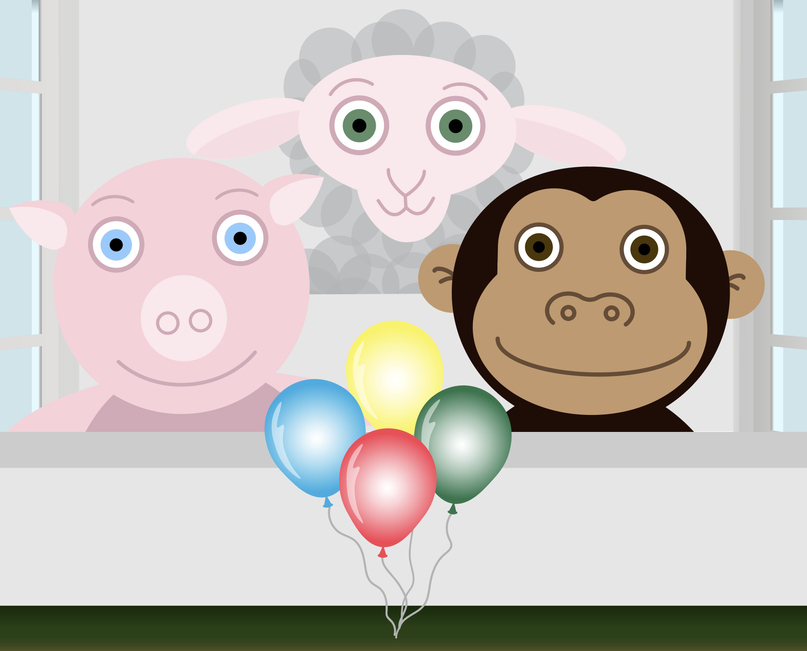
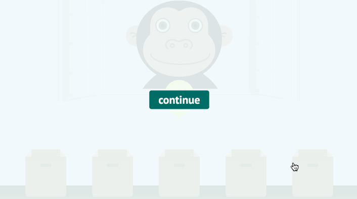
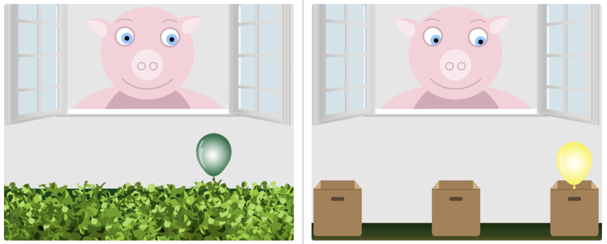

 

# 💃👀 TANGO

> A browser game to understand gaze cues

**🎮 Live Demo: https://ccp-odc.eva.mpg.de/tango-demo/**

## Preview

## About

This interactive browser game tracks your click responses and other metrics to study children’s ability to follow an agent’s gaze, using a continuous spatial layout. Moreover, you can decide whether to get recorded (via webcam) during the experiment. After completion, the app will automatically download two files: (1) a text file (JSON) containing responses, and—if selected by the user—(2) a video file (webm) of your webcam recording.¹

### Parameters

- German and English language support
- Optional webcam recording
- Gaming Modes: (1) a hedge version and (2) a box version. See here:

## Development

Development requires [Node.js](https://nodejs.org/en/)

### Local Development

1. `git clone git@github.com:ccp-eva/tango-demo.git`
1. `npm install`
1. `npm run dev`

### Deploy Application To A Server

1. `git clone git@github.com:ccp-eva/tango-demo.git`
1. `npm install`
1. `npm run build`
1. Upload the contents within the `dist` folder to your web hoster.

---

¹ Note that the Media Recorder API has a time scrubbing bug for chromium-based browsers (see here: https://bugs.chromium.org/p/chromium/issues/detail?id=569840). That means you cannot easily scrub through the recorded video. You can fix this by re-encoding the video. For example using Handbrake on macOS or ffmpeg (e.g., `ffmpeg -i video.webm -crf 24 -c:v libx264 video.mp4`), or any encoder of your choice.
